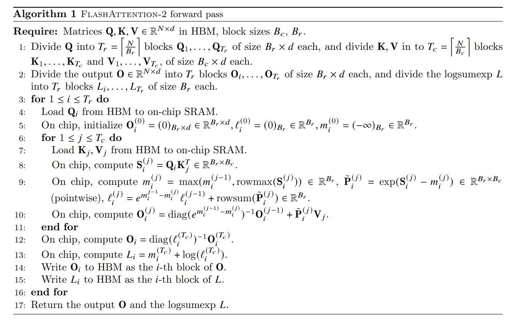

# FlashAttention 2 Implementation in Numba and CUDA

This repository is an attempt to implement the FlashAttention 2 algorithm from the research paper. The project leverages asynchronous parallel processing and layered memory management techniques by implementing the algorithm in two ways:

- **Numba-based Implementation:**  
  Uses Python with Numba's CUDA JIT facilities to get a better grasp of the algorithm before implementing the CUDA verison.
  
- **CUDA C++ Implementation:**  
  Uses raw CUDA to implement the FlashAttention 2 forward pass

## Overview

FlashAttention 2 efficiently computes scaled dot-product attention by splitting input matrices into blocks and leveraging on-chip SRAM, custom reductions, and careful kernel synchronization. This exercise follows the algorithm described below:



## Repository Structure

```
.
├── cuda_flash2
│   ├── flash_attention_2.cu      # Main CUDA implementation
│   ├── cuda_check.cu            # CUDA environment validation
│   └── profile_output.ncu-rep   # Performance profiling results
├── numba_flash2
│   ├── __init__.py
│   └── src
│       ├── flash_attention2.py           # Main Numba implementation
│       ├── flash_attention2_pytorch.py   # PyTorch reference implementation
│       ├── utils.py                      # Utility functions
│       └── flash_attention_decomposed/   # Modular components
└── examples
    └── UsageExample.ipynb       # Comprehensive usage examples and benchmarks
```

## Documentation

The codebase is extensively documented with:

- **Inline Documentation:** Detailed function and class docstrings explaining:
  - Purpose and algorithm details
  - Input/output specifications
  - Performance considerations
  - Memory layout and management
  - Implementation notes

- **Usage Examples:** The `examples/UsageExample.ipynb` notebook provides:
  - Step-by-step usage instructions
  - Performance benchmarking
  - Comparison with PyTorch's native attention
  - Parameter tuning guidelines

## Installation and Requirements

- **Hardware:** CUDA-enabled GPU  
- **Software:**  
  - Python (>= 3.7)  
  - [Numba](https://numba.pydata.org/)  
  - [PyTorch](https://pytorch.org/)  
  - CUDA Toolkit (compatible version with your GPU)

### Dependencies

Install the required packages:

```bash
pip install numba torch
```

## Running the Code

### Numba Version

To run the tests for the Numba implementation:

```bash
python -m unittest discover -s numba_flash2/src -p '*_test.py'
```

Or run the main flash attention script:

```bash
python numba_flash2/src/flash_attention2.py
```

### CUDA Version

Compile the CUDA code with `nvcc`:

```bash
nvcc -arch=sm_70 cuda_flash2/flash_attention_2.cu -o flash_attention_2
```

Then execute:

```bash
./flash_attention_2
```

## Performance Tuning

The implementation allows for performance tuning through several parameters:

1. **Block Sizes:**
   - `BrDim`: Row block size
   - `BcDim`: Column block size
   These can be adjusted based on your GPU's shared memory capacity and compute capabilities.

2. **Thread Block Configuration:**
   - Configurable thread block dimensions for optimal occupancy
   - Default values are optimized for common GPU architectures

3. **Memory Management:**
   - Careful shared memory allocation
   - Efficient data loading patterns
   - Optimized memory access patterns

See the usage examples for detailed performance tuning guidelines.

## Benchmarks and Comparison

The file `flash_attention2_pytorch.py` provides utilities for benchmarking and comparing with:
- PyTorch's native scaled dot-product attention
- Standard attention implementation
- Memory usage analysis
- Performance profiling

## Future Work and Contributions

- **Enhance Documentation:** Better inline comments and additional documentation in the docs folder.  
- **Expand Tests:** Organize and extend tests in a dedicated `tests/` folder.  
- **CI Integration:** Add GitHub Actions workflows to run tests automatically.  
- **Performance Tuning:** Further optimize kernel configurations and memory usage.  
- **Additional Examples:** Provide notebooks and tutorials for end-to-end demonstrations.

Contributions are welcome! Please feel free to submit issues or pull requests.

## License

This project is licensed under the [MIT License](LICENSE).

## Acknowledgements

This project was inspired by the FlashAttention 2 paper and serves as an exercise in advanced CUDA programming and parallel processing.
